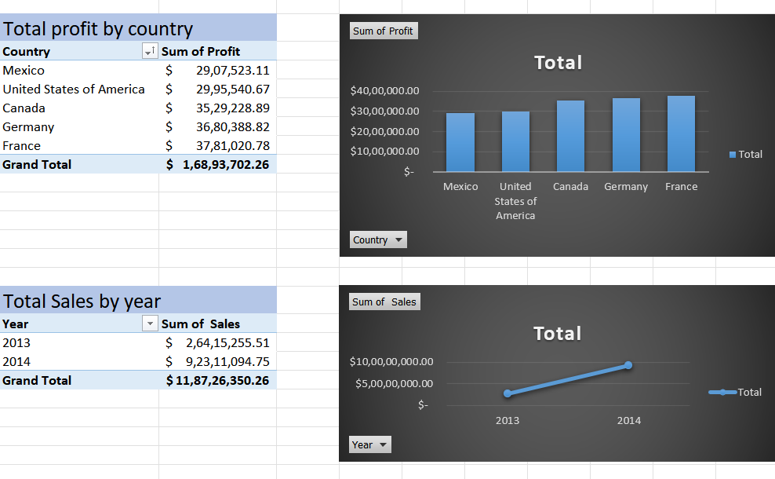
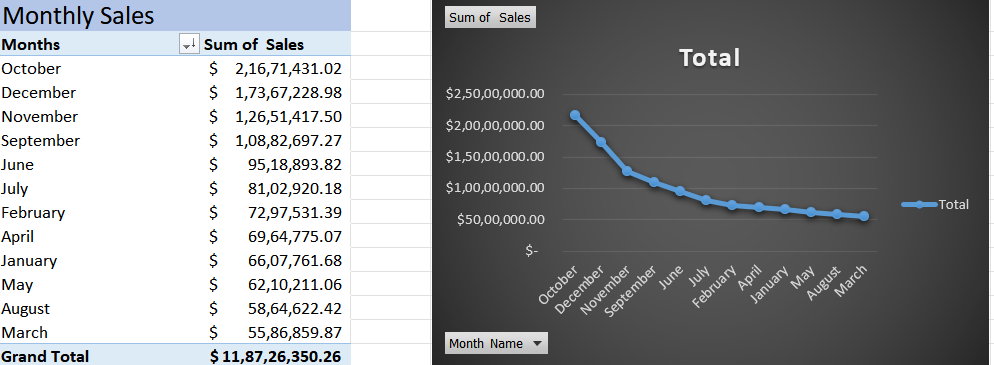

# Financial-Dataset-Analysis
Financial data analysis using Excel, SQL &amp; Power BI to uncover economic insights across Western countries
# 📊 Financial Dataset Analysis Project

This project focuses on analyzing the financial data of Western countries using **Excel**, **SQL**, and **Power BI**. It aims to uncover key economic insights by exploring indicators such as GDP, inflation, unemployment rate, and trade balance.

---

## 🚀 Objectives

- Perform structured analysis of financial indicators across Western economies
- Identify trends, patterns, and outliers in economic performance
- Visualize insights through an interactive Power BI dashboard
- Derive actionable insights that can assist in decision-making

---

## 🧰 Tools & Technologies

- **Excel** – Data cleaning, transformation, and preliminary analysis  
- **SQL** – Data extraction and query-based exploration  
- **Power BI** – Interactive dashboard for advanced data visualization
  
---
## 📷 Dashboard Preview

Here’s a snapshot of the interactive Power BI dashboard:

---

## 📊 Supporting Excel Visuals

### 📍 Total Profit & Total Sales Pivot Table

### 📍 Key Pivot Table View

---

## 📂 Project Presentation

📽️ Download the presentation summarizing key insights from the financial dataset analysis:

➡️ [Download Financial Dataset Analysis PPTX](Financial_Dataset_Analysis_presentation.pptx)

---

## 📂 Project Structure
/Excel_Analysis → Cleaned and explored data in Excel
/SQL_Scripts → SQL queries for deep data extraction
/PowerBI_Dashboard → Final interactive Power BI report
/Presentation_Slides → Project summary and insights

yaml
Copy
Edit

---

## 📈 Key Insights

- Highlighted top economies with consistent GDP growth and strong trade balance
- Detected inflation and unemployment trends across different countries
- Identified economic volatility and potential risk zones
- Enabled year-over-year comparison for policy and investment planning

---

## 📌 Outcome

The project demonstrates the effective use of **business analytics tools** to transform raw economic data into valuable insights, helping stakeholders make informed strategic decisions.

---

## 📎 Contact

For any questions or collaboration opportunities:

**Name**: Shashank Bajpai  
**LinkedIn**: [www.linkedin.com/in/shashank-bajpai-53871222a]  
**Email**: [shashankax0@gmail.com]

---

